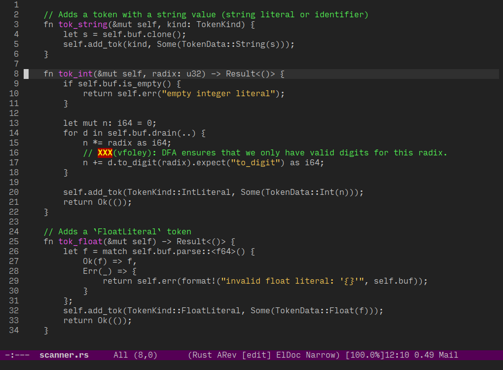
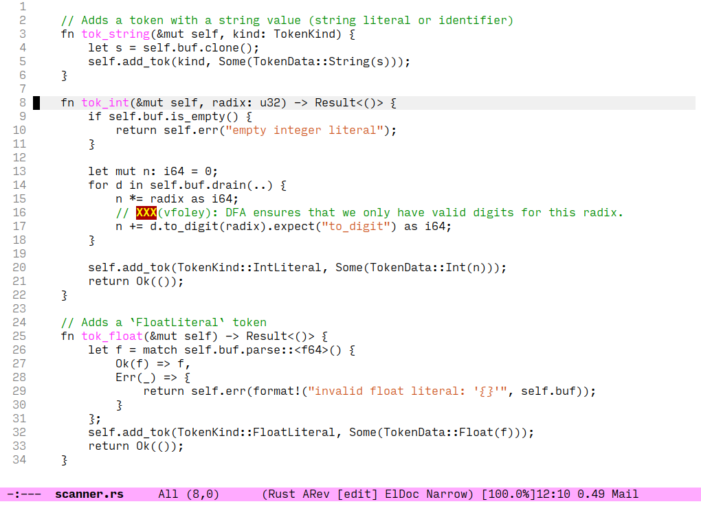

# purp

Purp is a theme—with light and dark variants—that highlights only a few syntactical constructs:

- Comments
- String and character literals
- Function names
- Unsafe constructs

Everything else uses the default color.
(Caveat: if the particular programming font that you use defines its own faces, you may see extra colors.)
The goal is to make it easier to spot important things in code and to avoid having a "fruit salad" where everything has a different color.

To load purp, use the following commands:

```elisp
;; load paths
(add-to-list 'load-path "/path/to/purp")
(add-to-list 'custom-theme-load-path "/path/to/purp")

;; dark theme
(load-theme 'purp t)

;; light theme
(load-theme 'purp-light t)
```

# Screenshots

There are two variants: `purp` is the dark variant, `purp-light` is the light variant.




